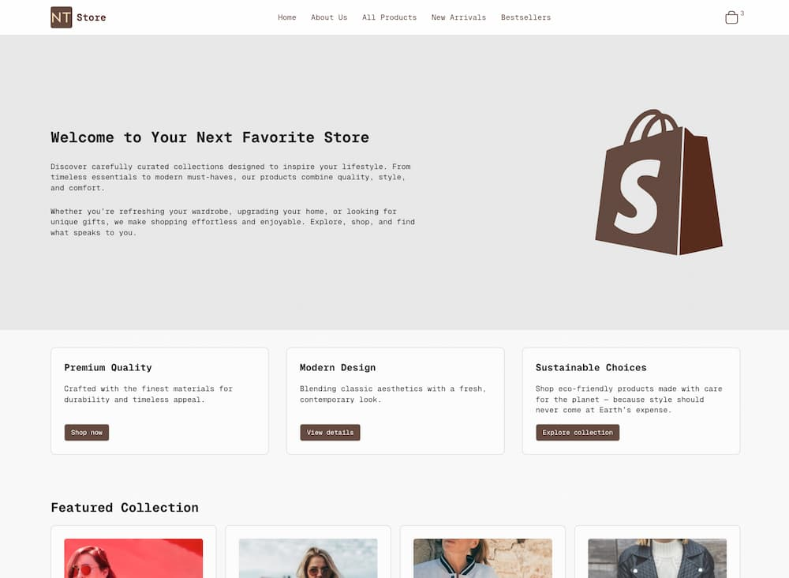

# Njordr Theme

NT Shop is a custom Shopify theme built from scratch (based on a minimal skeleton), focused on flexibility, clean design, and developer-friendly customization.
This repository contains the theme source code, schema configuration, and development workflow.

## Features

### Customizable Header

Add or change store logo directly from the theme editor.
Navigation menu powered by Shopify’s link_list.
Dynamic cart icon with item count.

### Flexible Sections

- Hero – highlight your main promotion or campaign.
- Highlights – display up to three key features or offers.
- Featured Products – showcase selected products on the homepage.
- Collections Grid – present product categories in a clean grid layout.
- Testimonials – add customer reviews or demo feedback to build trust.
- Blog Integration – display recent articles or guides to boost content marketing.

### Theme Settings

- Upload and manage a favicon.
- Typography controls with font_picker.
- Layout options: max page width, page margin, border radius.
- Full color system (background, foreground, primary, secondary, accent, destructive, border, input, chart colors, sidebar).
- Multi-language Support (i18n).

### Modern Build System (Vite)

- Fast development server with hot reload.
- Optimized asset bundling for production.
- Plugins for Shopify theme integration and asset cleaning.

### Lightweight & Clean

- Minimal default styling, easy to extend.
- Organized schema for intuitive customization.

## Tech Stack

- **Shopify Liquid** – template engine
- **Theme Schema JSON** – settings and customization
- **Shopify Locales JSON** – i18n / translations
- **Vite** – build system
- **vite-plugin-shopify & vite-plugin-shopify-clean** – Shopify integration
- **SCSS / CSS** – extendable theme styling
- **Alpine.js – lightweight JavaScript framework for interactivity**

## Project Structure

```bash
/assets
    theme-XXXX.css
    theme-XXXX.js
    icon-cart.svg
    shopify-logo.svg
/config
    settings_schema.json
    settings_data.json
/frontend
    entrypoints
    scripts
    styles
/layout
    theme.liquid
/locales
    en.default.json
    en.default.schema.json
/sections
    collection.liquid
    hero.liquid
    highlights.liquid
    testimonials.liquid
    blog.liquid
    faq.liquid
    header.liquid
    footer.liquid
    ...
/snippets
    button.liquid
    card.liquid
    css-variables.liquid
    ...
/templates
    404.liquid
    cart.liquid
    product.liquid
    ...
vite.config.js
package.json
```

## Getting Started

1. Clone the repository
   git clone https://github.com/njordulv/njordr-theme.git
   cd njordr-theme

2. Install Shopify CLI

Follow Shopify CLI installation guide:
https://shopify.dev/docs/themes/tools/cli

3. Login & Serve
   shopify login --store your-store.myshopify.com
   shopify theme dev

This will run the theme locally with hot reload.

4. Deploy to Production
   shopify theme push

This uploads your theme to Shopify and makes it available in the admin panel.

## Customization

- Logo → Upload via Theme Editor > Header > Logo.
- Favicon → Upload via Theme Settings > Favicon.
- Typography → Choose a font in Theme Settings > Typography.
- Colors & Layout → Fully adjustable in Theme Settings.

## Screenshot



## License

This project is licensed under the [MIT License](LICENSE).
